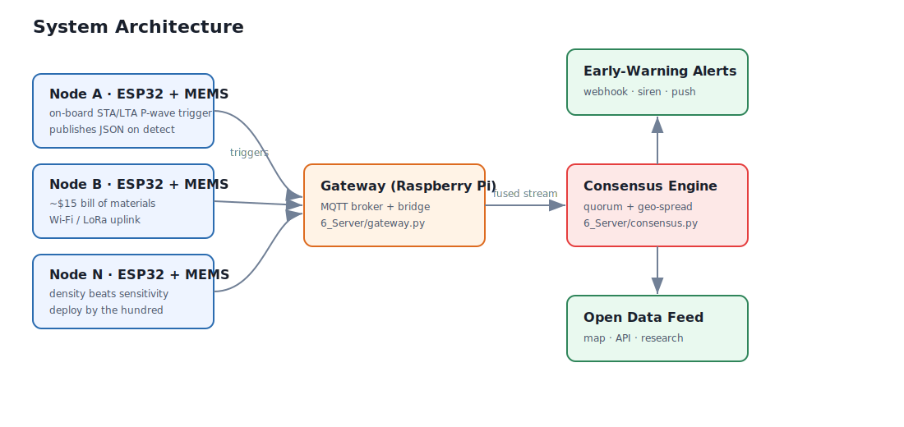

# System Architecture



## Layers

| Layer | Lives in | Responsibility |
|-------|----------|----------------|
| **Sensing** | `4_Firmware/node` | Sample the accelerometer at a fixed rate, run STA/LTA, emit a trigger on detection. |
| **Transport** | Wi-Fi / LoRa → MQTT | Carry compact JSON triggers to a gateway. |
| **Gateway** | `6_Server/gateway.py` | Subscribe to triggers, normalise, feed the consensus engine. |
| **Consensus** | `6_Server/consensus.py` | Confirm events via quorum + geographic spread + cooldown. |
| **Output** | webhook / API / map | Deliver early warnings and an open data feed. |

## The trigger payload

Every node speaks the same line-oriented JSON on topic `tremormesh/trigger`:

```json
{"id":"node-a1","lat":37.7749,"lon":-122.4194,"t":1717029384.12,"ratio":9.4}
```

That's the entire contract between firmware and server. Anything that can
publish this payload (an ESP32, a phone, a simulation, a different MCU) is a
valid node.

## Design principles

- **Density beats sensitivity.** The system is designed around many cheap,
  noisy nodes rather than few precise ones.
- **The detector is identical everywhere.** The recursive STA/LTA in the
  firmware is a line-for-line port of `tremormesh/stalta.py`, so behaviour is
  validated in Python and trusted on-device.
- **Consensus is transport-agnostic.** `consensus.py` doesn't know or care
  whether triggers came from MQTT, HTTP, or a test harness.
- **Fail safe, fail open.** A dead node simply stops reporting; the network
  degrades gracefully with coverage rather than failing all at once.

## Timing & warning budget


The warning window is the gap between the P-wave detection and the S-wave
arrival. It grows with distance from the epicenter, so nodes near the source
get little/no warning while everyone farther out benefits - exactly the
population that most needs it.
