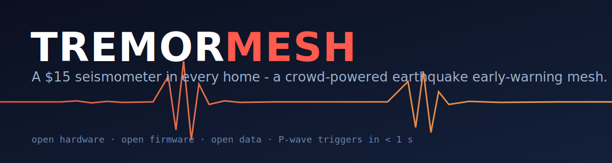
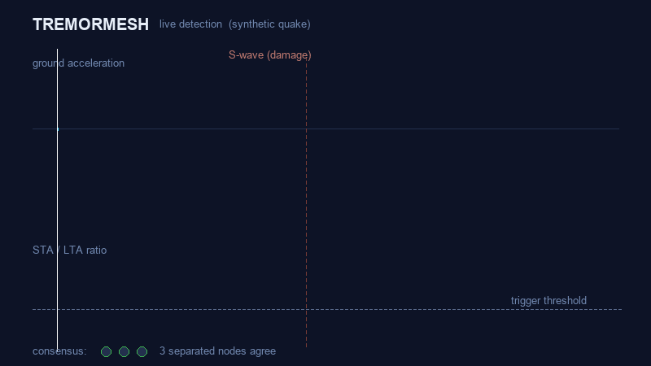

<p align="center">
  
</p>

<p align="center">
  
  
  
  
</p>

# TREMORMESH

A ~$15 seismometer you can build, plus the glue to make a bunch of them act as one earthquake early-warning network.

The systems that already do this (ShakeAlert, Japan's, Mexico's) work really well, but they run on seismometers that cost thousands of dollars apiece. So they're sparse, and most of the world that shakes isn't covered at all. I wanted to see how far you could get going the opposite direction: a pile of cheap ESP32 + MEMS nodes, each one kind of mediocre on its own, that only raise the alarm when enough of them agree. A real quake hits all of them at nearly the same instant. A slammed door hits one. That gap is the entire trick.

Each node listens for the fast, weak P-wave and gets a warning out before the slow, destructive S-wave shows up. If you're right on top of the epicenter you get nothing, that's just physics, but a few km out you can get anywhere from a couple of seconds to tens of seconds. That's enough time to drop and cover, stop a train, or close a gas valve.

**One thing up front:** this is alpha, and it's a hobby/research project. Please don't make it your only earthquake warning.

## See it run

<p align="center">
  
</p>

That's the real detector chewing on a synthetic quake, not a mock-up. The P-wave comes in, the STA/LTA ratio jumps past the trigger line, and once three separated nodes agree the network throws a warning before the S-wave lands. You can reproduce the whole thing with `tremormesh-demo` and `tremormesh-sim` (see below).

## How it works

A node samples a cheap accelerometer at 100 Hz and runs the classic STA/LTA trigger right on the ESP32. When the short-term energy jumps above the long-term background, it trips and publishes one line of JSON. A gateway collects those lines and runs a consensus check: enough nodes, far enough apart, close enough in time. Only then does anything get called an earthquake.

The detector on the microcontroller is a direct port of the Python in [`tremormesh/stalta.py`](tremormesh/stalta.py). That's on purpose, so I can test and tune the logic on a laptop and trust that the firmware does the same thing.


The contract between a node and the server is just this one message:

```json
{"id":"node-a1","lat":37.7749,"lon":-122.4194,"t":1717029384.12,"ratio":9.4}
```

Anything that can publish that, an ESP32, a phone, a simulation, is a node as far as the server cares.

### Why a warning is even possible


P-waves travel around 6 km/s, S-waves around 3.5. Catch the P and you've bought the gap until the S arrives. The closer you are to the source the smaller that gap, down to nothing in the blind zone near the epicenter; the farther out, the more warning you get.

## Two builds

| | Lite (~$15) | Pro (~$55) |
|---|---|---|
| Accelerometer | MPU-6050 (6-axis) | ADXL355 (low-noise, 24-bit) |
| Uplink | Wi-Fi / MQTT | Wi-Fi + LoRa (off-grid) |
| Time sync | NTP | GPS-PPS or DS3231 RTC |
| Good for | dense urban crowdsourcing | research and remote sites |

Full parts list and notes are in [`3_Hardware/3_1_BOM/BOM.md`](3_Hardware/3_1_BOM/BOM.md).

## Try it without any hardware

```bash
git clone https://github.com/tylrcc/tremor-mesh
cd tremor-mesh
pip install -e .

tremormesh-demo    # one node detecting a synthetic quake
tremormesh-sim     # a grid of nodes -> consensus -> warning lead time
```

Don't want to install anything? Run the scripts straight from the clone:

```bash
pip install -r requirements.txt
python 5_Algorithms/demo.py
python 7_Simulations/network_sim.py
```

You should see a P-wave caught in about a second and a positive warning lead time for anywhere past the blind zone.

## Build a real node

1. Grab the parts from the [BOM](3_Hardware/3_1_BOM/BOM.md) (~$15 for the Lite build).
2. Wire the accelerometer as shown in [`4_Firmware/node/README.md`](4_Firmware/node/README.md).
3. Edit the config block at the top of [`node.ino`](4_Firmware/node/node.ino) (id, location, Wi-Fi, broker) and flash it.
4. Run the gateway somewhere always-on, a Raspberry Pi is perfect: `python 6_Server/gateway.py --host <pi-ip>`.

The part people get wrong: **bolt or epoxy the node to something structural.** A unit sitting loose on a desk mostly measures the desk. Mounting matters more than which sensor you bought. There's more on this in the [enclosure notes](3_Hardware/3_3_Enclosure/README.md).

## Layout

```
tremor-mesh/
├── tremormesh/                installable package (the actual logic)
│   ├── stalta.py              recursive STA/LTA detector
│   ├── synthetic.py           synthetic seismogram generator
│   ├── consensus.py           quorum / geo-spread consensus engine
│   └── cli.py                 tremormesh-demo / tremormesh-sim
├── 1_Project_Description/     the problem and the bet
├── 2_System_Architecture/     how the pieces fit
├── 3_Hardware/                BOM, wiring, enclosure
├── 4_Firmware/                ESP32 node + gateway notes
├── 5_Algorithms/              runnable demo + detector tests
├── 6_Server/                  MQTT gateway + consensus tests
├── 7_Simulations/             full-pipeline simulation
├── 8_Utils/                   diagrams and the demo animation
├── tools/                     render_demo.py (makes the GIF/MP4)
└── docs/                      roadmap, licensing, FAQ
```

## Tests

```bash
pytest -q
```

CI runs the tests and the demos on Python 3.9, 3.11, and 3.12 for every push and PR.

## License

Dual-licensed, which is normal for open hardware: the hardware and docs are CERN-OHL-P, the code and firmware are MIT. The reasoning is in [docs/licensing.md](docs/licensing.md).

## Docs

- [What this is and why](1_Project_Description/PROJECT.md)
- [Architecture](2_System_Architecture/ARCHITECTURE.md)
- [FAQ](docs/faq.md)
- [Roadmap](docs/roadmap.md)
- [Security policy](SECURITY.md)

## Contributing

There's a stack of [good first issues](https://github.com/tylrcc/tremor-mesh/issues) if you want somewhere to start. I'd especially love help from anyone who knows embedded work, DSP/seismology, or distributed systems, but honestly the most useful thing right now is people building a node and telling me where it falls over. Details in [CONTRIBUTING.md](CONTRIBUTING.md).

## Where it's rough

I'd rather be honest about the holes than pretend they aren't there:

- A single cheap node is noisy. The whole thing lives or dies on density and on how well nodes are mounted.
- Clock sync between nodes is hand-wavy on the Lite build (it leans on NTP). Tighter sync is on the roadmap.
- Nothing stops a malicious node from injecting fake triggers yet. Signed triggers are a planned fix, and I treat that as a [security issue](SECURITY.md).
- It says "something happened," not "expect this much shaking." Magnitude/intensity estimation is still TODO.

If you star it, it's because you want a $15 seismometer in more places. So do I.
